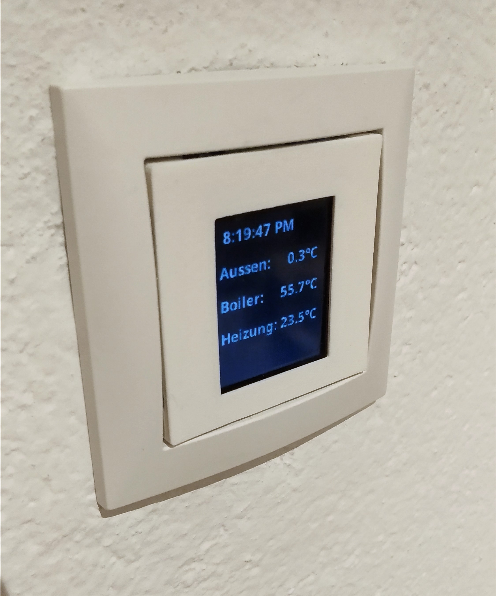
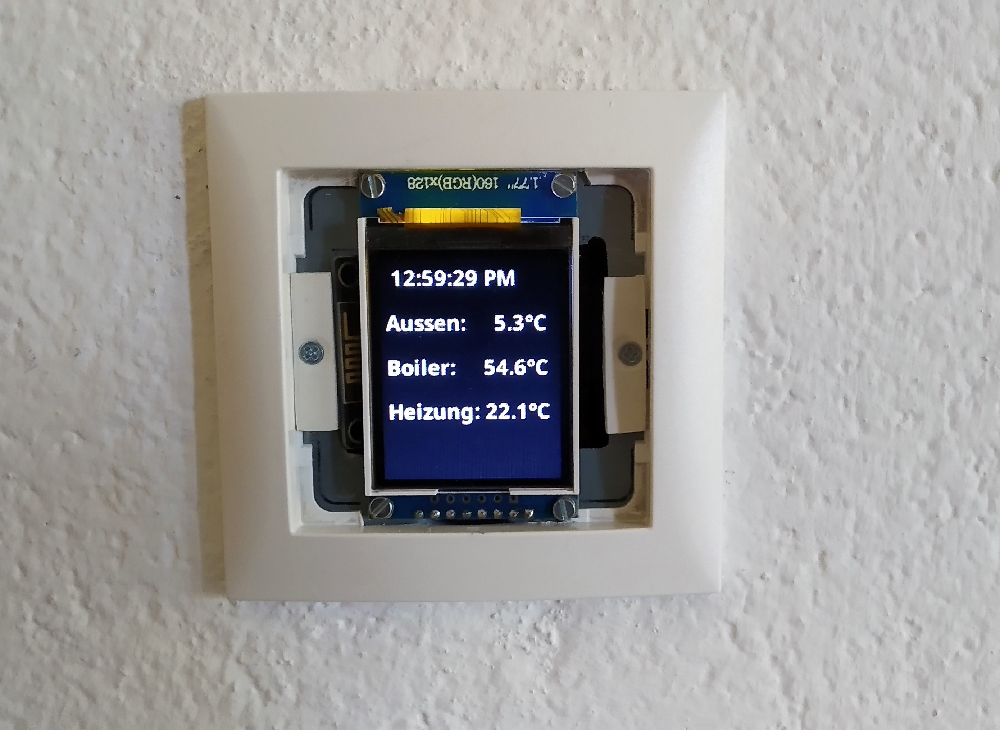
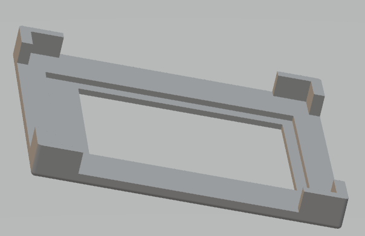

# MqttDisplay
ESP8266 based MQTT client with TFT display for flush mount

### Used Components
  * ESP8266 NodeMcu Module
  * 1,77" TFT display module (ST7735)
  
### Features
  * 8-9 rows of text with smooth font (thanks to https://github.com/Bodmer/TFT_eSPI)
  * Wifi Client with dhcp
  * Mqtt client with reconnect
  * Backlight dimming with PWM
  * OTA update (Over the air) (thanks to https://github.com/ayushsharma82/AsyncElegantOTA)
  
With cover

Without cover

Stl model for 3D printer

